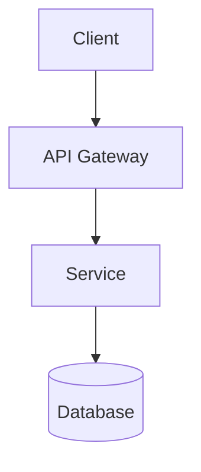
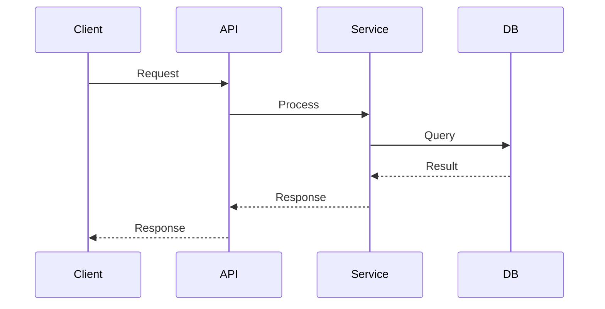

# Templates Library
## Monarch Castle Technologies

> **Purpose**: Standardized templates for all organizational documents

---

## 1. PRODUCT REQUIREMENT DOCUMENT (PRD)

```markdown
# PRD: [Feature Name]

| Field | Value |
|-------|-------|
| PRD ID | PRD-YYYY-NNN |
| Author | MCT-PM-001 |
| Status | Draft / In Review / Approved |
| Created | YYYY-MM-DD |
| Last Updated | YYYY-MM-DD |
| Approvers | MCT-CPO-001, MCT-ARCH-001 |

---

## 1. Executive Summary
[One paragraph describing what we're building and why]

## 2. Problem Statement

### 2.1 Current State
[Describe the current user experience or system state]

### 2.2 Pain Points
- **Pain Point 1**: [Description] → Impact: [High/Medium/Low]
- **Pain Point 2**: [Description] → Impact: [High/Medium/Low]

### 2.3 Evidence
- [Metric/data point supporting the problem]
- [User feedback/research]

## 3. Goals & Success Metrics

### 3.1 Objectives
| Objective | Key Result | Target | Timeline |
|-----------|------------|--------|----------|
| [O1] | [KR1] | [X%] | [Q1 2026] |
| [O1] | [KR2] | [Y] | [Q1 2026] |

### 3.2 Anti-Goals
- [What we are explicitly NOT trying to achieve]

## 4. User Stories

### 4.1 Persona: [Persona Name]
> [Brief persona description]

#### Story 1: [Story Title]
- **As a** [persona]
- **I want to** [action]
- **So that** [benefit]

**Acceptance Criteria:**
- [ ] Given [context], when [action], then [result]
- [ ] Given [context], when [action], then [result]

**Edge Cases:**
- [Edge case 1]: [Expected behavior]
- [Edge case 2]: [Expected behavior]

## 5. Functional Requirements

### FR-1: [Requirement Title]
- **Priority**: P0/P1/P2
- **Description**: [Detailed description]
- **Business Rules**: [Any rules that apply]

### FR-2: [Requirement Title]
...

## 6. Non-Functional Requirements

| Category | Requirement | Target |
|----------|-------------|--------|
| Performance | Page load time | < 2s |
| Scalability | Concurrent users | 10,000 |
| Availability | Uptime | 99.9% |
| Security | Auth method | OAuth 2.0 |
| Accessibility | WCAG level | AA |

## 7. Out of Scope
- [Feature/capability explicitly not included]
- [Future consideration]

## 8. Dependencies

| Dependency | Owner | Status | Risk |
|------------|-------|--------|------|
| [Dep 1] | [Agent] | [Status] | [Risk] |

## 9. Timeline

| Milestone | Date | Deliverable |
|-----------|------|-------------|
| Design Complete | YYYY-MM-DD | Wireframes, mockups |
| Dev Complete | YYYY-MM-DD | Feature code |
| QA Complete | YYYY-MM-DD | Test results |
| Launch | YYYY-MM-DD | Production deploy |

## 10. Open Questions
- [ ] [Question 1] → Assigned: [Agent] → Due: [Date]
- [ ] [Question 2] → Assigned: [Agent] → Due: [Date]

## 11. Appendix
- [Link to designs]
- [Link to research]
- [Link to technical docs]

---

## Revision History

| Version | Date | Author | Changes |
|---------|------|--------|---------|
| 0.1 | YYYY-MM-DD | [Agent] | Initial draft |
```

---

## 2. TECHNICAL DESIGN DOCUMENT (TDD)

```markdown
# TDD: [Feature Name]

| Field | Value |
|-------|-------|
| TDD ID | TDD-YYYY-NNN |
| Author | MCT-ARCH-001 |
| PRD Reference | PRD-YYYY-NNN |
| Status | Draft / In Review / Approved |
| Created | YYYY-MM-DD |
| Reviewers | MCT-SEC-001, MCT-DBA-001 |

---

## 1. Overview

### 1.1 Summary
[Brief description of the technical solution]

### 1.2 Background
[Context and motivation for technical decisions]

## 2. Architecture

### 2.1 System Diagram



### 2.2 Component Overview

| Component | Purpose | Technology |
|-----------|---------|------------|
| [Comp 1] | [Purpose] | [Tech] |
| [Comp 2] | [Purpose] | [Tech] |

## 3. Detailed Design

### 3.1 [Component Name]

#### 3.1.1 Responsibilities
- [Responsibility 1]
- [Responsibility 2]

#### 3.1.2 Interface
```typescript
interface ComponentInterface {
  method1(param: Type): ReturnType;
  method2(param: Type): ReturnType;
}
```

#### 3.1.3 Data Flow



## 4. API Specification

### 4.1 Endpoints

#### POST /api/resource
- **Description**: Create a new resource
- **Auth**: Required (Bearer token)
- **Request Body**:
```json
{
  "name": "string",
  "value": "number"
}
```
- **Response (201)**:
```json
{
  "data": {
    "id": "uuid",
    "name": "string",
    "value": "number",
    "createdAt": "datetime"
  }
}
```
- **Errors**: 400, 401, 409, 500

## 5. Database Design

### 5.1 Schema

```sql
CREATE TABLE resources (
  id UUID PRIMARY KEY DEFAULT gen_random_uuid(),
  name VARCHAR(255) NOT NULL,
  value INTEGER NOT NULL,
  created_at TIMESTAMPTZ DEFAULT NOW(),
  updated_at TIMESTAMPTZ DEFAULT NOW()
);

CREATE INDEX idx_resources_name ON resources(name);
```

### 5.2 Migrations
- Migration 001: Create resources table
- Migration 002: Add indexes

## 6. Security Considerations

### 6.1 Threat Model

| Threat | Mitigation |
|--------|------------|
| [Threat 1] | [Mitigation] |
| [Threat 2] | [Mitigation] |

### 6.2 Authentication
[Auth mechanism details]

### 6.3 Authorization
[RLS policies, role-based access]

## 7. Performance Considerations

### 7.1 Expected Load
- Requests per second: [N]
- Data volume: [X] records

### 7.2 Optimization Strategy
- Caching: [Strategy]
- Indexing: [Strategy]
- Pagination: [Strategy]

## 8. Monitoring & Observability

### 8.1 Metrics
- [Metric 1]: [Description]
- [Metric 2]: [Description]

### 8.2 Alerts
- [Alert 1]: Trigger when [condition]

### 8.3 Logging
- [What to log, at what level]

## 9. Rollback Plan

### 9.1 Feature Flag
- Flag name: `feature_[name]`
- Default: `false`

### 9.2 Database Rollback
- Down migration: [Script reference]

### 9.3 Procedure
1. Disable feature flag
2. If DB changes: Run down migration
3. Deploy previous version

## 10. Testing Strategy

| Test Type | Scope | Owner |
|-----------|-------|-------|
| Unit | [Components] | DEV |
| Integration | [APIs] | DEV |
| E2E | [User flows] | QA |
| Performance | [Endpoints] | QA |

## 11. Implementation Tickets

| Ticket | Description | Assignee | Estimate |
|--------|-------------|----------|----------|
| [ID] | [Description] | [Agent] | [Points] |

---

## Revision History

| Version | Date | Author | Changes |
|---------|------|--------|---------|
| 0.1 | YYYY-MM-DD | [Agent] | Initial draft |
```

---

## 3. TEST PLAN

```markdown
# Test Plan: [Feature Name]

| Field | Value |
|-------|-------|
| Test Plan ID | TP-YYYY-NNN |
| Author | MCT-QA-001 |
| PRD Reference | PRD-YYYY-NNN |
| TDD Reference | TDD-YYYY-NNN |
| Status | Draft / Active / Complete |

---

## 1. Overview

### 1.1 Objective
[What are we testing and why]

### 1.2 Scope
- **In Scope**: [What will be tested]
- **Out of Scope**: [What won't be tested]

## 2. Test Strategy

| Test Level | Coverage | Tools |
|------------|----------|-------|
| Unit | 80%+ | Vitest |
| Integration | Critical paths | Vitest |
| E2E | User journeys | Playwright |
| Performance | Key endpoints | k6 |

## 3. Test Scenarios

### 3.1 [Scenario Group]

#### TC-001: [Test Case Title]
- **Priority**: P0/P1/P2
- **Preconditions**: [Setup required]
- **Steps**:
  1. [Step 1]
  2. [Step 2]
- **Expected Result**: [What should happen]
- **Status**: [ ] Pass / [ ] Fail / [ ] Blocked

#### TC-002: [Test Case Title]
...

## 4. Test Data

| Data Type | Source | Notes |
|-----------|--------|-------|
| [Type 1] | [Source] | [Notes] |

## 5. Environment

| Environment | URL | Purpose |
|-------------|-----|---------|
| Dev | dev.monarchcastle.tech | Development testing |
| Staging | staging.monarchcastle.tech | Pre-production |
| Production | monarchcastle.tech | Production validation |

## 6. Entry Criteria
- [ ] Feature development complete
- [ ] Code review approved
- [ ] Deployed to test environment
- [ ] Test data prepared

## 7. Exit Criteria
- [ ] All P0 tests pass
- [ ] All P1 tests pass
- [ ] P2 tests: 90%+ pass rate
- [ ] No open P0/P1 bugs
- [ ] Performance benchmarks met

## 8. Risks & Mitigations

| Risk | Impact | Mitigation |
|------|--------|------------|
| [Risk 1] | [Impact] | [Mitigation] |

## 9. Schedule

| Activity | Start | End | Owner |
|----------|-------|-----|-------|
| Test prep | MM-DD | MM-DD | QA |
| Execution | MM-DD | MM-DD | QA |
| Bug fixes | MM-DD | MM-DD | DEV |
| Regression | MM-DD | MM-DD | QA |

## 10. Sign-off

| Role | Name | Date | Signature |
|------|------|------|-----------|
| QA Lead | MCT-QA-001 | | |
| PM | MCT-PM-001 | | |
```

---

## 4. INCIDENT REPORT

```markdown
# Incident Report: [Incident Title]

| Field | Value |
|-------|-------|
| Incident ID | INC-YYYY-NNN |
| Severity | SEV1/SEV2/SEV3/SEV4 |
| Status | Active / Resolved / Postmortem Complete |
| Commander | [Agent/Human] |
| Duration | [Start] to [End] |

---

## 1. Executive Summary
[One paragraph summary of what happened, impact, and resolution]

## 2. Timeline (All times UTC)

| Time | Event |
|------|-------|
| HH:MM | [Event 1] |
| HH:MM | [Event 2] |

## 3. Impact

### 3.1 User Impact
- Users affected: [Number or %]
- Duration: [Time]
- Functionality impacted: [Description]

### 3.2 Business Impact
- Revenue impact: [If applicable]
- SLA breach: [Yes/No]

## 4. Root Cause Analysis

### 4.1 What Happened
[Detailed technical explanation]

### 4.2 Why It Happened
[5 Whys or similar analysis]

### 4.3 Contributing Factors
- [Factor 1]
- [Factor 2]

## 5. Resolution

### 5.1 Immediate Actions
- [Action taken to restore service]

### 5.2 Permanent Fix
- [Long-term solution implemented]

## 6. Lessons Learned

### 6.1 What Went Well
- [Positive aspect 1]

### 6.2 What Went Poorly
- [Issue 1]

### 6.3 Where We Got Lucky
- [Near miss or fortunate circumstance]

## 7. Action Items

| Action | Owner | Due Date | Status |
|--------|-------|----------|--------|
| [Action 1] | [Agent] | [Date] | [ ] |
| [Action 2] | [Agent] | [Date] | [ ] |

## 8. Appendix
- [Links to logs, dashboards, etc.]
```

---

## 5. RUNBOOK

```markdown
# Runbook: [Service/Process Name]

| Field | Value |
|-------|-------|
| Runbook ID | RB-NNN |
| Owner | MCT-OPS-001 |
| Last Updated | YYYY-MM-DD |
| Review Cycle | Monthly |

---

## 1. Service Overview

### 1.1 Description
[What this service does]

### 1.2 Architecture
[High-level architecture diagram]

### 1.3 Dependencies
| Dependency | Type | Impact if Down |
|------------|------|----------------|
| [Dep 1] | [Type] | [Impact] |

## 2. Health Checks

### 2.1 Endpoints
| Endpoint | Expected | Check Frequency |
|----------|----------|-----------------|
| /health | 200 OK | 30s |
| /api/health | 200 OK | 30s |

### 2.2 Dashboards
- [Link to Grafana dashboard]
- [Link to error tracking]

## 3. Common Issues

### Issue 1: [Issue Title]

**Symptoms:**
- [Symptom 1]
- [Symptom 2]

**Diagnosis:**
```bash
# Check logs
kubectl logs -l app=service-name --tail=100
```

**Resolution:**
1. [Step 1]
2. [Step 2]

**Escalation:**
If not resolved in [X minutes], escalate to [Agent/Team]

### Issue 2: [Issue Title]
...

## 4. Operational Procedures

### 4.1 Deployment

```bash
# Production deployment
./scripts/deploy.sh production

# Verify deployment
curl https://api.monarchcastle.tech/health
```

### 4.2 Rollback

```bash
# Rollback to previous version
./scripts/rollback.sh

# Verify rollback
curl https://api.monarchcastle.tech/health
```

### 4.3 Scaling

```bash
# Scale up
kubectl scale deployment service-name --replicas=5

# Scale down
kubectl scale deployment service-name --replicas=2
```

## 5. Contacts

| Role | Contact | Escalation Time |
|------|---------|-----------------|
| Primary On-Call | [Agent] | Immediate |
| Secondary | [Agent] | 15 min |
| Management | [Human] | 30 min |

## 6. Revision History

| Version | Date | Author | Changes |
|---------|------|--------|---------|
| 1.0 | YYYY-MM-DD | [Agent] | Initial |
```

---

*All documents must use these templates. Deviations require CPO approval.*
